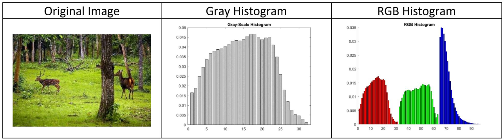
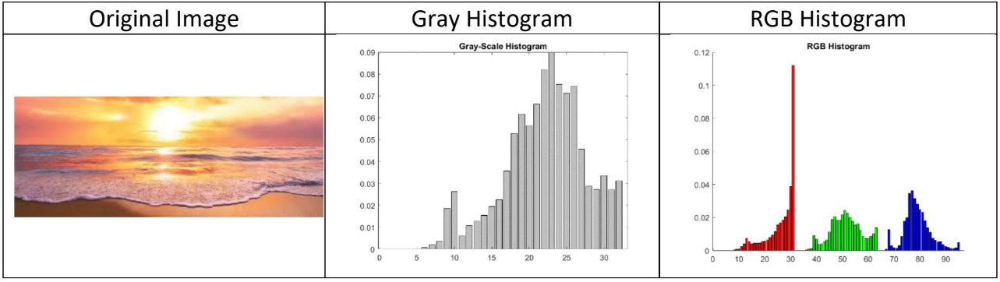

# Image-Histogram

A representation of the tonal distribution of each channel for digital images

- ### Gray Scale Histogram
- ### RGB Histogram

## Test Image 1: "forest"

 

## Test Image 2: "sunset"

